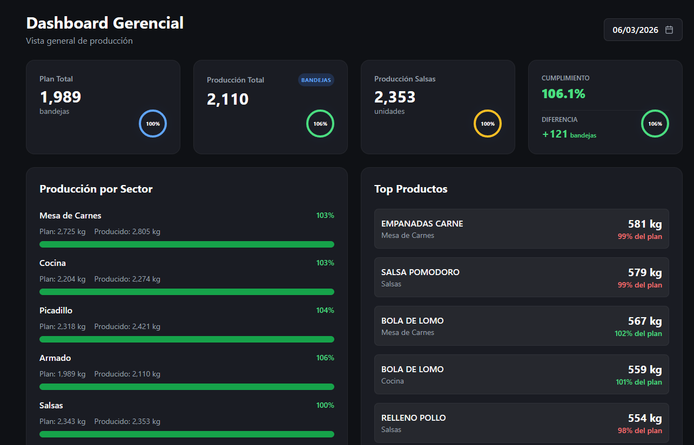
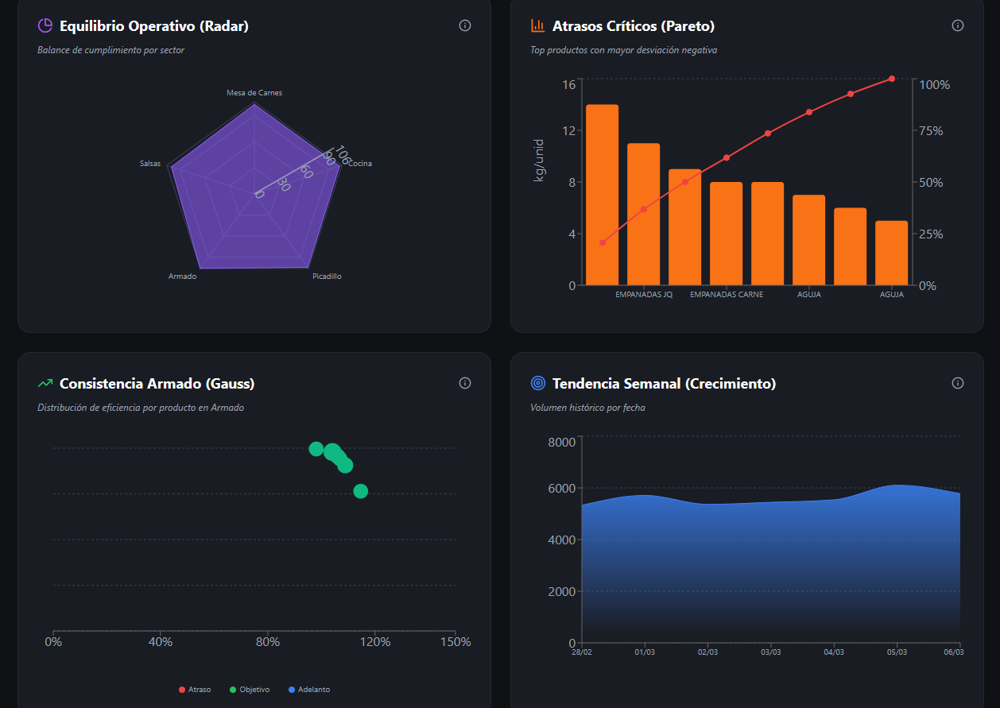
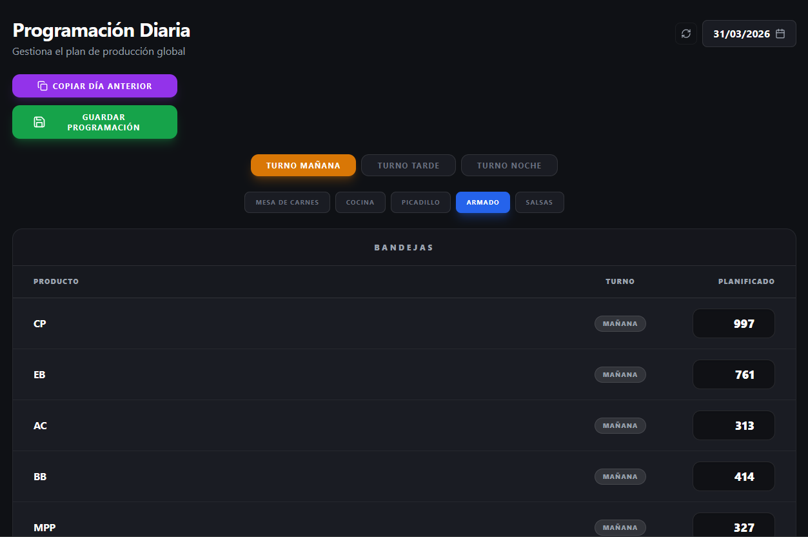
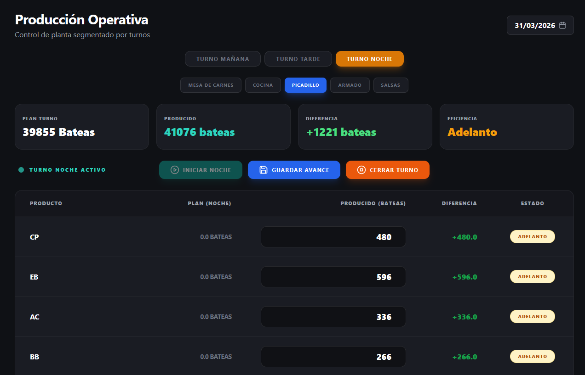
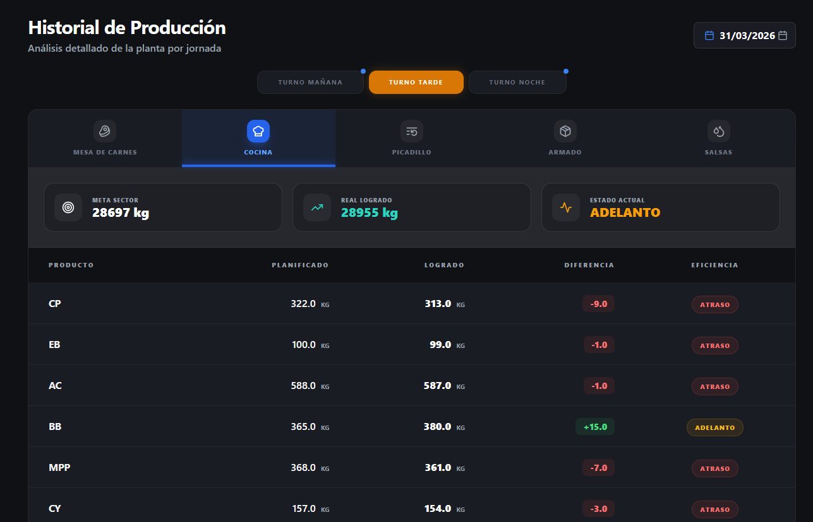
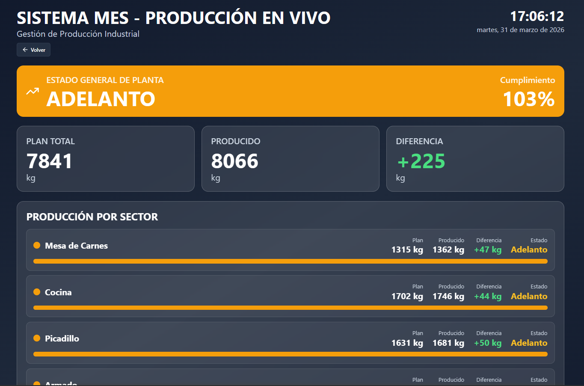

# Mi Gusto MES (Manufacturing Execution System) 🏭🚀

## 📖 Descripción General

**Mi Gusto MES** es un sistema integral de **Gestión de Ejecución de Manufactura** diseñado específicamente para optimizar y monitorear los procesos de producción en tiempo real. Este sistema actúa como un puente vital entre la planificación de la producción y la ejecución técnica en el taller, proporcionando visibilidad total sobre las operaciones.

Desarrollado íntegramente por el **Departamento de Sistemas de Mi Gusto**, esta plataforma web centraliza el control de programación, seguimiento de lotes, métricas de rendimiento y trazabilidad histórica.

---

## ✨ Características Principales

El sistema se divide en módulos clave diseñados para cubrir cada etapa del ciclo productivo:

-   **📊 Dashboard de Control**: Visualización de KPIs críticos como el estado de producción por sectores, cumplimiento de objetivos y rendimientos térmicos mediante gráficas interactivas.
-   **📅 Programación de Producción**: Interface intuitiva para el agendamiento y planificación diaria de las órdenes de trabajo.
-   **📦 Producción en Tiempo Real**: Panel operativo para el registro de avances, control de salidas por sector y monitoreo de procesos activos.
-   **📜 Historial de Operaciones**: Repositorio centralizado de registros históricos para auditoría, análisis de tendencias y trazabilidad total.
-   **🖥️ Interfaz de Planta (Screen Mode)**: Vista optimizada para monitores industriales en el área de trabajo, diseñada para máxima visibilidad y legibilidad a distancia.

---

## 📸 Vistas del Sistema

### 📊 Dashboard y Estadísticas
Visualización en tiempo real de los indicadores clave de rendimiento (KPIs) y analítica de datos.

### 📅 Programación y Seguimiento
Planificación estratégica de las órdenes de producción diarias.

### 📦 Módulo de Producción
Panel de control para operarios con registro de avances por sector.

### 📜 Historial de Registros
Trazabilidad completa de todas las operaciones realizadas.

### 🖥️ Interfaz de Planta
Diseño HUD (Heads-Up Display) de alto contraste optimizado para la planta.

---

## 📂 Documentación Adjunta

Dentro de la carpeta `Docs/` se encuentran recursos esenciales para operarios y personal técnico:
-   📄 **Guía de uso para MES planta.docx**: Manual detallado de operación.
-   📊 **Presentación MES Mi Gusto.pptx**: Resumen ejecutivo y visión del sistema.
-   ⚠️ **Resolución de Problemas y FAQ**: Guía rápida para soporte técnico común.

---

## 🔒 Seguridad y Privacidad

El acceso al sistema está protegido mediante el robusto sistema de autenticación de **Supabase**, garantizando que solo el personal autorizado de los sectores correspondientes pueda visualizar o modificar los datos críticos de producción.

---

## 🏗️ Créditos

Este sistema es propiedad exclusiva de **Mi Gusto**.
Derechos reservados © 2026 - Departamento de Sistemas.

- **Facundo Carrizo** — GitHub: [@facu14carrizo](https://github.com/facu14carrizo) · LinkedIn: [facu14carrizo](https://www.linkedin.com/in/facu14carrizo)
- **Ramiro Lacci** — GitHub: [@ramirolacci19](https://github.com/ramirolacci19) · LinkedIn: [ramiro-lacci](https://www.linkedin.com/in/ramiro-lacci)
